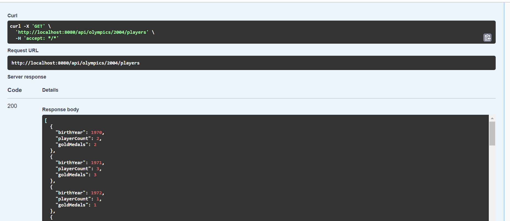



# **Домашнее задание 7 по курсу Базы Данных**
## Кухтина Юлия БПИ224
### Задание
#### Описание дата сета
У спортсмена есть олимпийское удостоверение, имя, пол, страна и дата рождения.
У каждой олимпиады есть год, сезон (летний или зимний), страна, где она проходила, и город.
Каждый спортсмен в базе данных участвует по крайней мере в одной олимпиаде. Спортсмен может участвовать в нескольких соревнованиях на одной Олимпиаде и фактически может участвовать более чем в одной Олимпиаде. Например, Майкл Армстронг участвовал в соревнованиях по плаванию, дайвингу и водному поло. Ян Торп участвовал в летних Олимпийских играх 2000 года в Сиднее и завоевал 3 золотые и 2 серебряные медали. В Афинах 2004 года он завоевал две золотые, одну серебряную и одну бронзовую медали.
У события есть название вида спорта, название события, место проведения, а также запланированное время и дата, какие спортсмены должны были участвовать в соревнованиях, в каких соревнованиях и как они разместились, и кто был победителем (победителями) события (например, какой медалью они были награждены). Вы можете предположить, что нулевые значения используются для победителей и мест размещения до тех пор, пока событие не будет проведено.
Соревнования на Олимпийских играх могут быть как индивидуальными, так и командными. Если это командное мероприятие, мы хотим знать, кто был членом каждой команды. 

Задание выполняется с использованием любого языка/фреймворка. Рекомендуется Java/Python/PHP
наиболее удобные, понятные и простые ORM.
Требуется сделать:
Создать миграции, согласно схемы по ссылке выше
Создать скрипт для автоматического наполнения базы данных (seeder). Если не нашли готовой библиотеки, можно написать свой класс, который будет использовать любую библиотеку/сервис faker. В метод передаете сколько в качестве параметра количество записей которые нужно создать в БД. На выходе получаем БД с фейковыми заполненными данными.
Выполнить следующие задания с помощью ORM:
* Для Олимпийских игр 2004 года сгенерируйте список (год рождения, количество игроков, количество золотых медалей), содержащий годы, в которые родились игроки, количество игроков, родившихся в каждый из этих лет, которые выиграли по крайней мере одну золотую медаль, и количество золотых медалей, завоеванных игроками, родившимися в этом году.
* Перечислите все индивидуальные (не групповые) соревнования, в которых была ничья в счете, и два или более игрока выиграли золотую медаль.
* Найдите всех игроков, которые выиграли хотя бы одну медаль (GOLD, SILVER и
BRONZE) на одной Олимпиаде. (player-name, olympic-id).
* В какой стране был наибольший процент игроков (из перечисленных в наборе данных), чьи имена начинались с гласной?
* Для Олимпийских игр 2000 года найдите 5 стран с минимальным соотношением количества групповых медалей к численности населения.

### Для запуска приложения:
- Склонируйте репозиторий с помощью `git clone git@github.com:yuulkht/db-hw7-orm.git`
- Откройте проект в `IntelliJ IDEA`
- Запустите БД с помощью команды `docker-compose up -d` в папке `dev-env`
- Запустите приложение с помощью `Run`
- Зайдите на сайт `http://localhost:8080/swagger-ui.html`
- Пользуйтесь функционалом приложения

### Основные библиотеки
- **Spring Boot** `3.3.5`  
  Основной фреймворк для создания приложения.
- **Spring Data JPA**  
  Работа с базой данных через Hibernate.
- **Spring Web**  
  Поддержка REST-контроллеров и веб-приложений.
- **SpringDoc OpenAPI**  
  Генерация Swagger UI для документации API.

### Скрин примера работы программы

*Рисунок 1. Выполнение одного из запросов*